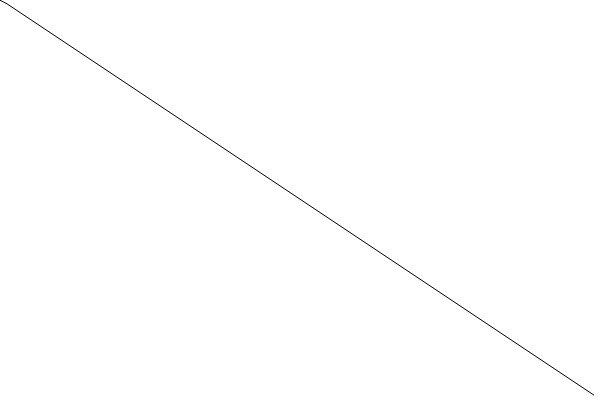
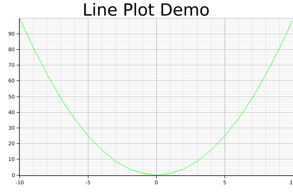

# [Plotters Developer Guide](https://plotters-rs.github.io/book/)

- Add dependency to `Cargo.toml`

  ```cmd
  cargo add plotters
  ```

---

## Basic plotting

---

### Define chart context

先に述べたように、Plottersは描画ライブラリです。理論的には、Plottersの描画APIに基づいて、あらゆるデータプロットを描くことができるはずです。描画APIの上には、チャート・コンテキストが用意されていて、データの可視化に適した環境を整えています。

---

#### Create a chart context from a drwaing area

`ChartBuilder`は、チャート・コンテキストを作成するためのビルダー・タイプです。

次のコードは、X軸とY軸の両方が0から100の範囲である2次元の直交座標を使用したチャートコンテキストを作成する方法を示しています。

```rust
use plotters::prelude::*;

fn main() {
  let drawing_area = BitMapBackend::new("images/2.0.png", (1024, 768))
    .into_drawing_area();
  
  let _chart = ChartBuilder::on(&drawing_area)
    .build_cartesian_2d(0..100, 0..100)
    .unwrap();
}
```

---

#### Draw series on to the chart context

チャートのコンテキストができたら、その上に系列を置くことができます。この例では、`LineSeries`タイプを使用して、チャート上にラインシリーズを描きます。

```rust
use plotters::prelude::*;

fn main() {
  let drawing_area = BitMapBackend::new("images/2.1.png", (600, 400))
    .into_drawing_area();

  drawing_area.fill(&WHITE).unwrap();
  
  let mut chart = ChartBuilder::on(&drawing_area)
    .build_cartesian_2d(0..100, 0..100)
    .unwrap();

  chart.draw_series(
    LineSeries::new((0..100).map(|x| (x, 100 - x)), &BLACK),
  ).unwrap();
}
```

このコードでは、以下の図が表示されます。



---

### Draw figure components

多くの場合、チャートには軸やメッシュグリッドなどの多くのコンポーネントが必要です。`ChartContext`タイプは、これらのコンポーネントを自動的に描画することができます。

---

#### Mesh

以下のコードは、`ChartContext::configure_mesh`を使用して、チャートにメッシュを追加する方法を示しています。

```rust
use plotters::prelude::*;

fn main() {
  let root_drawing_area = BitMapBackend::new("images/2.2.png", (600, 400))
    .into_drawing_area();

  root_drawing_area.fill(&WHITE).unwrap();

  let mut ctx = ChartBuilder::on(&root_drawing_area)
    .build_cartesian_2d(0..100, 0..100)
    .unwrap();

  ctx.configure_mesh().draw().unwrap();

}
```

---

#### Axes

プロットに軸を追加するには、2つのステップが必要です。

1. `ChartContext`の作成時に、ラベル領域のサイズを定義します。
2. `configure_mesh`を使用して、チャート・コンポーネントを描画します。

次のコードは、軸を追加する方法を示しています。

```rust
use plotters::prelude::*;

fn main() {
  let root_drawing_area = BitMapBackend::new("images/2.3.png", (600, 400))
    .into_drawing_area();

  root_drawing_area.fill(&WHITE).unwrap();

  let mut ctx = ChartBuilder::on(&root_drawing_area)
    // enables Y axis, the size is 40 px
    .set_label_area_size(LabelAreaPosition::Left, 40)
    // enable X axis, the size is 40 px
    .set_label_area_size(LabelAreaPosition::Bottom, 40)
    .build_cartesian_2d(0..100, 0..100)
    .unwrap();

  ctx.configure_mesh().draw().unwrap();

}
```

---

#### Title

次の例は、`ChartBuilder::caption`を使用してプロットにタイトルを追加する方法を示しています。

プロッタでは、フォントを表現する最も一般的な方法は、フォントフェイス名とフォントサイズのタプルを使用することです。

```rust
use plotters::prelude::*;

fn main() {
  let root_drawing_area = BitMapBackend::new("images/2.4.png", (600, 400))
    .into_drawing_area();

  root_drawing_area.fill(&WHITE).unwrap();

  let mut ctx = ChartBuilder::on(&root_drawing_area)
    .caption("Figure Sample", ("Arial", 30))
    .set_label_area_size(LabelAreaPosition::Left, 40)
    .set_label_area_size(LabelAreaPosition::Bottom, 40)
    .build_cartesian_2d(0..100, 0..100)
    .unwrap();

  ctx.configure_mesh().draw().unwrap();

}
```

---

### Basic data Plotting

このセクションでは、Plottersを使用して、さまざまなタイプのプロットを作成してみましょう。一般的に、`ChartContext::draw_series`APIは、あらゆる種類のチャートを描画する機能を提供します。以下では、このAPIを使ってさまざまな種類のプロットを描画する方法について説明します。

---

#### LIne series

次のコードは、プロッタで線分を描く方法を示しています。

```rust
use plotters::prelude::*;

fn main() {
  let root_area = BitMapBackend::new("images/2.5.png", (600, 400))
    .into_drawing_area();
  root_area.fill(&WHITE).unwrap();

  let mut ctx = ChartBuilder::on(&root_area)
    .set_label_area_size(LabelAreaPosition::Left, 40)
    .set_label_area_size(LabelAreaPosition::Bottom, 40)
    .caption("Line Plot Demo", ("sans-serif", 40))
    .build_cartesian_2d(-10..10, 0..100)
    .unwrap();

  ctx.configure_mesh().draw().unwrap();

  ctx.draw_series(
    LineSeries::new((-10..=10).map(|x| (x, x* x)), &GREEN)
  ).unwrap();
}
```

このコードでは、以下の図が表示されます。

